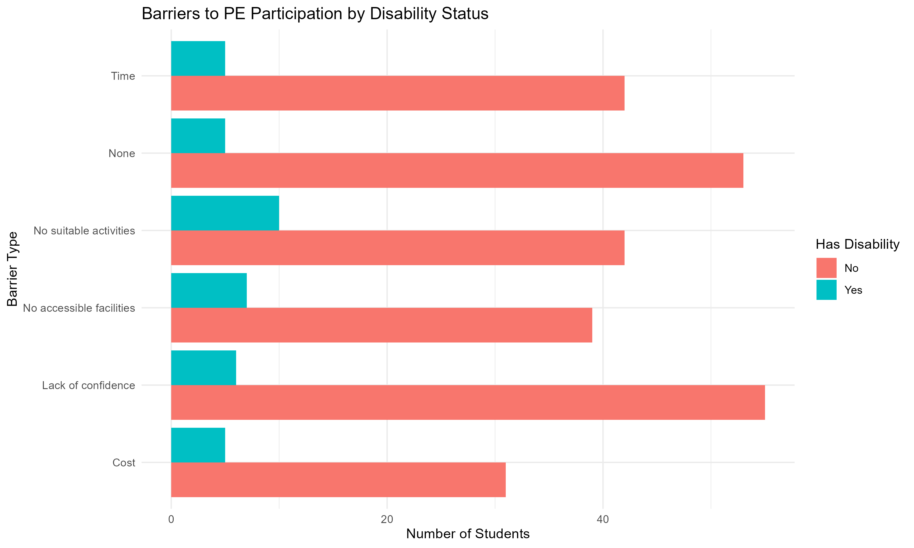
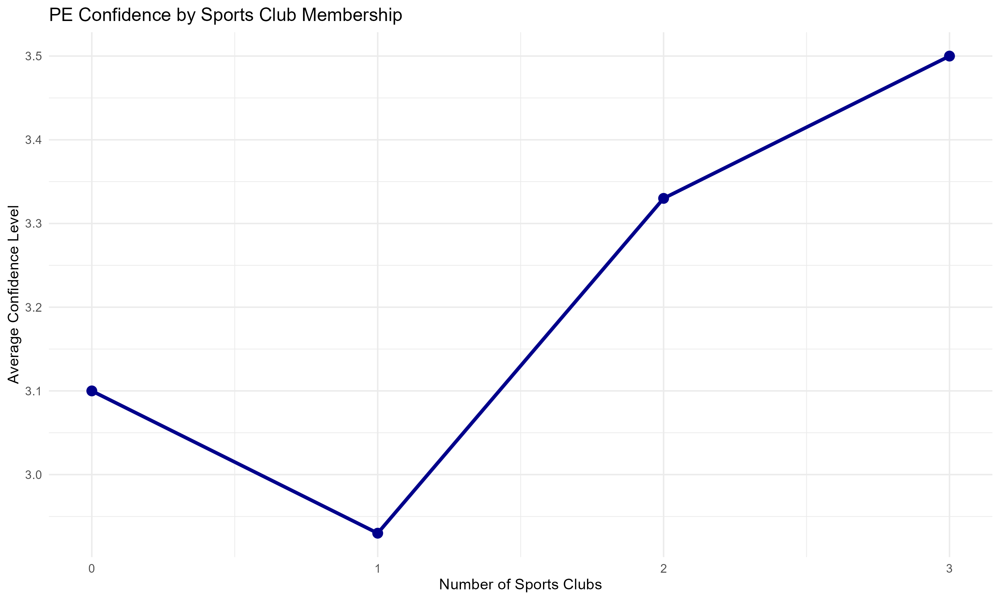
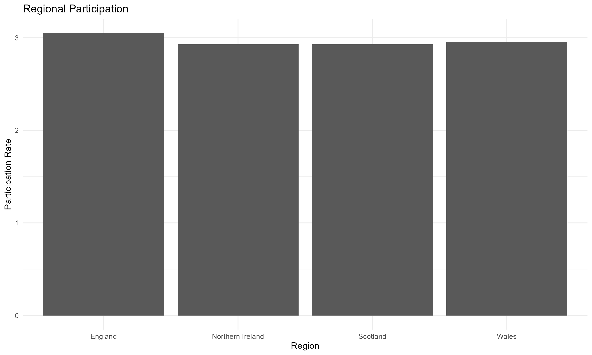

# PE Participation & Inclusion Analysis

## Overview
Analysis of 300 students' physical education participation patterns, with focus on inclusion barriers for students with disabilities. This project combines my background in PE and dissertation research on teacher attitudes toward inclusion with data analysis skills.

## Research Context
Having completed a dissertation on PE teacher attitudes toward inclusion and working with students with additional support needs, I wanted to analyze actual participation data to understand what barriers students face and whether these differ by disability status.

## Key Findings

### 1. Equal Access, Different Experiences
Students with disabilities participate at nearly the same frequency as students without disabilities (2.92 vs 2.97 times/week), suggesting inclusive PE provision in terms of access.

### 2. Structural vs Psychological Barriers 
**Critical finding:** Students with disabilities face different barriers:
- **Structural barriers dominate:** "No suitable activities" (26%) + "No accessible facilities" (18%) = 44%
- **Psychological barriers secondary:** "Lack of confidence" only 16%

Students WITHOUT disabilities face primarily psychological barriers:
- "Lack of confidence" is #1 barrier (21%)

**Implication:** Addressing inclusion requires systemic changes (planning, facilities), not just individual support.

### 3. Club Engagement Builds Confidence
Clear progression showing more sports clubs → higher confidence:
- 3 clubs: 3.50 confidence
- 2 clubs: 3.33
- 1 club: 2.93
- 0 clubs: 3.10

### 4. Regional & School Equity
Minimal variation across regions (2.93-3.05) and school types (private 3.03 vs state 2.95), indicating relatively equitable PE provision.

## Recommendations

**For Schools:**
- Develop adapted activities addressing the #1 barrier for disabled students
- Improve facility accessibility
- Encourage sports club participation to build confidence

**Connection to Research:**
This analysis demonstrates that while teacher attitudes (my dissertation focus) are important, they must be supported by suitable activities and accessible facilities for true inclusion.

## Methodology
- **Sample:** 300 students (ages 11-18)
- **Analysis:** SQL queries for data aggregation and pattern identification
- **Visualization:** ggplot2 for professional charts
- **Variables:** Disability status, participation frequency, barriers, confidence, teacher support, sports clubs, school type, region

## Visualizations

### Barriers by Disability Status

Shows structural barriers (activities, facilities) affect disabled students more than psychological barriers.

### Confidence by Sports Club Membership

Demonstrates positive relationship between club involvement and PE confidence.

### Regional Participation

Shows equitable PE provision across UK regions.

## Files
- `pe_analysis.R` - Complete analysis code with SQL queries
- `pe_participation_data.csv` - Survey dataset (300 students)
- `PROJECT_FINDINGS.md` - Detailed findings and recommendations
- Chart files (PNG format)

## Skills Demonstrated
- SQL (GROUP BY, WHERE, HAVING, aggregations, multi-table analysis)
- R programming (tidyverse, sqldf, data manipulation)
- Data visualization (ggplot2)
- Statistical interpretation and insight generation
- Domain expertise (PE, inclusion, education policy)
- Research-to-practice application

## About Me
Background in PE and sports, with dissertation research on inclusion. Currently working with students with additional support needs. Passionate about using data to improve educational accessibility and equity.
